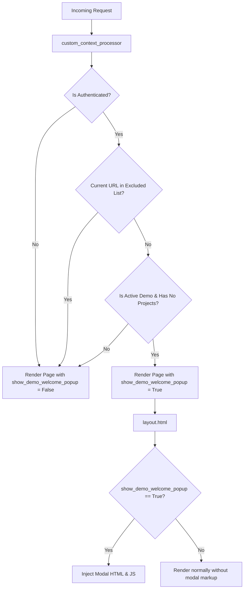

# Design Document: Global Demo Onboarding Welcome Popup

## Overview
This document outlines the architecture, components, and templates required to relocate, adapt, and render the premium onboarding welcome popup globally across the Profit Pro platform. 

The goal is to show a welcoming, instructional modal to new Demo Tier users who have not yet created custom projects. The popup will show on all pages *except* the Project Create view and the User Profile views (detail/edit).

---

## Architecture & Data Flow

### 1. Global Context Processor
Rather than manual context assignments within individual views, state evaluation is centralized inside a custom context processor:
`app.core.Utilities.context_processors.custom_context_processor`.

This function resolves the current view name and sets the `show_demo_welcome_popup` boolean context variable.

### 2. View Exclusions
The modal is suppressed on the following namespaces/URLs:
- `project:project-create` (Create project view)
- `users:account:user_detail` (Profile detail view)
- `users:account:user_edit` (Profile edit view)

---

## Detailed Component Specifications

### 1. Context Processor Modifications
Location: `app/core/Utilities/context_processors.py`

The custom context processor will:
- Check if `request.user.is_authenticated`.
- Extract the current URL's resolved name (`request.resolver_match.view_name`).
- Verify whether the user has active demo permissions (`has_demo_permission`) and has not yet created non-demo projects (`get_projects.filter(is_demo=False).exists()`).
- Verify the current page is not inside the exclusion array.

### 2. Template Modifications
- **layout.html** (`app/templates/layout.html`):
  - Add `` at the top.
  - Insert the modal HTML block at the bottom (before the `</body>` tag), wrapped in an `` conditional block.
- **home.html** (`app/core/templates/core/home.html`):
  - Completely remove the previous onboarding welcome modal code (lines 313–493).
- **views.py** (`app/core/views.py`):
  - Remove `show_demo_welcome_popup` code in `HomeView.get_context_data` to ensure a Single Source of Truth in the context processor.

### 3. Modal Content & CTA Revisions
- **Card 1: Portfolio Management**:
  - *Icon*: `briefcase` (indigo)
  - *Summary*: Track the complete performance of your projects, team members, and comprehensive portfolio health at a glance.
- **Card 2: Progress & Productivity**:
  - *Icon*: `chart-bar` (violet)
  - *Summary*: Monitor daily resource utilisation, cost variances, and auto-generated cashflow forecasts based on real-time field performance.
- **Card 3: Project Estimator**:
  - *Icon*: `calculator` (cyan)
  - *Summary*: Rapidly build resource-based first-principles estimates, pricing schedules, and custom price libraries in a matter of minutes.

- **Primary CTA**: "Create Your First Project" pointing to ``.
- **Secondary CTA**: "View Profile" pointing to `{{ request.user.detail_url }}`.
- **State Dismissal**: Clicking either CTA writes `dismissed_demo_welcome` state to `localStorage` client-side, preventing subsequent renders.

---

## Verification & Testing Plan

### Automated View Tests
Location: `app/core/tests/test_global_demo_welcome.py`

We will write unit tests verifying that `show_demo_welcome_popup` resolves correctly under all configurations:
1. `test_anonymous_visitor` -> evaluates to `False`.
2. `test_non_demo_user` -> evaluates to `False`.
3. `test_active_demo_user_no_projects` on regular page (e.g. `home` or `about`) -> evaluates to `True`.
4. `test_active_demo_user_no_projects` on profile page (`users:account:user_detail`) -> evaluates to `False`.
5. `test_active_demo_user_no_projects` on create project page (`project:project-create`) -> evaluates to `False`.
6. `test_active_demo_user_with_own_project` -> evaluates to `False`.

### Linter Checks
Run `ruff check .` and `ruff format .` to guarantee perfect formatting and style compliance.
